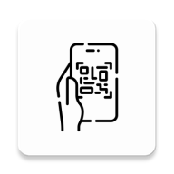

<div align="center">
  
</div>
# Multiple QR Code Scanner (Android, CameraX + ML Kit)

Bu repo, aynı karede birden fazla QR/Data Matrix kodunu hızlı ve isabetli şekilde tespit etmek için optimize edilmiş bir CameraX + ML Kit uygulamasını içerir. Jetpack Compose ile yazılmış arayüz, düşük gecikme ve yüksek kare/saniye hedefiyle tasarlanmıştır.

## 🎯 Öne Çıkanlar
- ✅ Birden fazla kodu aynı anda yakalama ve ekranda poligon olarak işaretleme
- ✅ QR Code ve Data Matrix desteği (kolayca genişletilebilir)
- ✅ Düşük gecikme için `ImageAnalysis.STRATEGY_KEEP_ONLY_LATEST`
- ✅ Ekrana doğru köşe dönüşümleri (ölçek/offset) ile isabetli overlay
- ✅ Compose Canvas üzerinde hafif Path kullanımı ve animasyonlu köşe güncellemeleri
- ✅ Kullanıcı etkileşimi: poligon içine dokunarak "doğrulanmış" işaretleme
- ✅ Benzersiz (unique) içerik listesi ve anlık güncelleme

## 🏗️ Mimari Genel Bakış

```
┌─────────────────────────────────────────────────────────────┐
│                      MainActivity                           │
│         (Kamera izni → QRScannerScreen)                     │
└─────────────────────────────────────────────────────────────┘
                              │
┌─────────────────────────────────────────────────────────────┐
│                     QRScannerScreen                         │
│  ┌─────────────────┐  ┌──────────────────────────────────┐  │
│  │  CameraPreview  │  │         Canvas Overlay           │  │
│  │  (CameraX +     │  │  (Poligonlar, Animasyonlar,      │  │
│  │   ML Kit)       │  │   Dokunma Algılama)              │  │
│  └─────────────────┘  └──────────────────────────────────┘  │
│  ┌──────────────────────────────────────────────────────┐   │
│  │           Alt Panel (Tespit Listesi)                 │   │
│  └──────────────────────────────────────────────────────┘   │
└─────────────────────────────────────────────────────────────┘
```

- **MainActivity**: Kamera izni verildiğinde `QRScannerScreen`'i yükler.
- **QRScannerScreen**: 
  - Kamera önizlemesini (`CameraPreview`) barındırır.
  - Tespit edilen kodları ve benzersiz/doğrulanmış durumlarını yönetir.
  - Compose Canvas ile poligonları çizer, animasyonları ve dokunma algılamayı yapar.
- **CameraPreview**: 
  - CameraX `Preview` + `ImageAnalysis` kurulumu.
  - ML Kit ile kare bazlı barkod/QR okuma ve sonuçların UI thread'e aktarımı.
  - Ekran koordinatlarına dönüşüm ve performans dostu bellek yönetimi.

## ⚡ Performans Tasarımı ve Optimizasyonlar

Bu proje çoklu kod okumasına yönelik olarak aşağıdaki stratejilerle optimize edilmiştir:

### 1. Backpressure ve İş Parçacığı Yönetimi
- `ImageAnalysis.STRATEGY_KEEP_ONLY_LATEST`: Kuyruktaki eski kareler atılır, analiz daima son kareye uygulanır; bu sayede gecikme düşer ve CPU yükü dengelenir.
- Tek `Executor` (singleThreadExecutor): ML Kit işlem hattı için yeterli; thread çakışmalarını ve bağlam değiştirme maliyetini azaltır.

### 2. Çözünürlük ve En/Boy Oranı
- `ResolutionSelector` ile 4:3 tercih ve **1920×1080** çözünürlük: Çoklu QR için yeterli ayrıntı sunarken fallback stratejisi ile uyumluluk.
- Fallback stratejisi: Yakın üst çözünürlük yoksa altına düş; tutarlı performans.

### 3. Hafıza Tahsisini Azaltma
- Köşe dönüşümleri için küçük, sabit kapasiteli listeler (`ArrayList<PointF>(4)`).
- Compose `Path.rewind()` ile path nesnesini yeniden kullanma, çöp üretimini minimize etme.
- **Stroke ve Color nesnelerini `remember` ile cache'leme**: Her frame'de yeniden oluşturmayı önler.
- Animasyonlarda mevcut `Animatable` nesnelerini güncelleme; gereksiz yeni nesne yaratmama.

### 4. UI/Çizim Verimliliği
- Canvas çizimi için `graphicsLayer(alpha = 0.99f)` ile donanım hızlandırma.
- **`CompositingStrategy.Offscreen`**: Daha verimli GPU compositing.
- Poligon merkezi hesaplaması sıfır ek tahsis ile basit ortalama.
- Ana iş parçacığına sonuç aktarımı için `mainExecutor.execute { ... }`: güvenli ve kontrollü UI güncellemesi.

### 5. Dönüşüm Doğruluğu
- Kaynak (kamera frame) ile hedef (PreviewView) arasındaki ölçek ve offset hesaplamaları, döndürme (90/270°) dikkate alınarak yapılır; overlay ile gerçek köşeler hizalanır.

## 📊 Performans Metrikleri

| Metrik | Değer |
|--------|-------|
| **Hedef FPS** | 25-30 FPS |
| **Çözünürlük** | 1920×1080 |
| **Eş Zamanlı QR** | 10+ kod desteklenir |
| **Gecikme** | < 100ms (tipik) |
| **Bellek Yönetimi** | Minimum GC |

## 🎬 Çoklu Kod Okuma Senaryoları

| Senaryo | Açıklama |
|---------|----------|
| **Raf/Etiket Tarama** | Aynı karede yan yana birden fazla DM/QR etiketi. Proje, her bir kodun köşelerini doğru hesaplayıp ayrı poligonlar çizer. |
| **Form/Fiş Tarama** | Kodlar bölgesel olarak çakışsa da ray-casting ile dokunulan poligon tespit edilir; kullanıcı tek tek onaylayabilir. |
| **Hareketli Sahne** | `KEEP_ONLY_LATEST` ve tek iş parçacığı sayesinde kamera hareketinde dahi akıcı kalır; sürüklenme etkisi azalır. |
| **Depo/Envanter** | Birden fazla ürün etiketini tek seferde tarayıp doğrulama yapabilirsiniz. |

## 📱 Kullanım

1. Kamera izni verildiğinde `QRScannerScreen` açılır.
2. `CameraPreview` kodları algılar ve `onQRCodesDetected` ile UI'ye iletir.
3. Ekranda **kırmızı kenarlıklar** ile tespit edilen kodların poligonları görünür.
4. Poligon içine dokunarak kodu "**Doğrulandı**" durumuna geçirebilirsiniz (yeşil kenarlık ve merkezde onay işareti).
5. Alt panelde benzersiz içeriklerin listesi ve doğrulama durumu yer alır. "**Tespitleri Temizle**" ile sıfırlayabilirsiniz.

## 💻 Örnek Kod Parçaları

### Barkod Tarayıcı Yapılandırması
```kotlin
val scanner = remember {
    val options = BarcodeScannerOptions.Builder()
        .setBarcodeFormats(
            Barcode.FORMAT_DATA_MATRIX,
            Barcode.FORMAT_QR_CODE
        )
        .build()
    BarcodeScanning.getClient(options)
}
```

### ImageAnalysis Kurulumu
```kotlin
val resolutionSelector = ResolutionSelector.Builder()
    .setAspectRatioStrategy(AspectRatioStrategy.RATIO_4_3_FALLBACK_AUTO_STRATEGY)
    .setResolutionStrategy(
        ResolutionStrategy(
            Size(1920, 1080), // Yüksek çözünürlük = daha fazla QR detayı
            ResolutionStrategy.FALLBACK_RULE_CLOSEST_HIGHER_THEN_LOWER
        )
    )
    .build()

val imageAnalysis = ImageAnalysis.Builder()
    .setOutputImageFormat(ImageAnalysis.OUTPUT_IMAGE_FORMAT_YUV_420_888)
    .setResolutionSelector(resolutionSelector)
    .setBackpressureStrategy(ImageAnalysis.STRATEGY_KEEP_ONLY_LATEST)
    .build()
```

### Canvas Performans Optimizasyonu
```kotlin
// Cache'lenmiş nesneler (her frame'de yeniden oluşturulmaz)
val path = remember { Path() }
val strokeStyle = remember { Stroke(width = 15f) }
val verifiedColor = remember { Color(0xFF4CAF50) }
val unverifiedColor = remember { Color(0xFFFF0000) }

Canvas(
    modifier = Modifier
        .fillMaxSize()
        .graphicsLayer(
            alpha = 0.99f, // Donanım hızlandırma
            compositingStrategy = CompositingStrategy.Offscreen // Verimli compositing
        )
) {
    // Path'i yeniden kullan (sıfır bellek tahsisi)
    path.apply {
        rewind()
        moveTo(...)
        // ...
    }
    drawPath(path = path, color = verifiedColor, style = strokeStyle)
}
```

### Ray-Casting ile Dokunma Algılama
```kotlin
/**
 * Bir noktanın poligon içinde olup olmadığını kontrol eder.
 * Ray Casting algoritmasını kullanır.
 */
private fun isPointInPolygon(point: Offset, polygon: List<Offset>): Boolean {
    if (polygon.size < 3) return false
    var isInside = false
    var i = 0
    var j = polygon.size - 1
    while (i < polygon.size) {
        val pi = polygon[i]
        val pj = polygon[j]
        if (((pi.y > point.y) != (pj.y > point.y)) &&
            (point.x < (pj.x - pi.x) * (point.y - pi.y) / (pj.y - pi.y) + pi.x)
        ) {
            isInside = !isInside
        }
        j = i++
    }
    return isInside
}
```

## 🚀 Kurulum ve Çalıştırma

1. **Android Studio** Iguana veya üstü ile açın
2. Gradle sync yapın
3. Cihaz veya emülatör seçin
4. Run butonuna tıklayın

**Gereksinimler:**
- Min SDK: Projenin gradle yapılandırmasına göre
- Kamera izni: `MainActivity` ilk açılışta izin ister
- ML Kit ve CameraX bağımlılıkları `libs.versions.toml`/Gradle dosyalarında tanımlı

## 🔧 İpuçları ve Özelleştirme

| Alan | Öneri |
|------|-------|
| **Format Ekleme** | `BarcodeScannerOptions`'a `FORMAT_AZTEC`, `FORMAT_PDF417` vb. ekleyin |
| **Çözünürlük** | Düşük güçlü cihazlarda 1280×720'ye düşürün; güçlü cihazlarda 2560×1440 deneyin |
| **Stroke Kalınlığı** | Çok sayıda poligon varsa `Stroke(width = 8f)` ile daha ince çizgiler |
| **Animasyon** | `Spring.StiffnessHigh` ile daha hızlı animasyonlar |

## ✅ Doğrulama Akışı

1. Kullanıcı ekrana dokunur
2. `isPointInPolygon` ile tıklanan noktanın hangi poligon içinde olduğu tespit edilir
3. İlgili QR kodu "doğrulanmış" setine eklenir
4. Poligon rengi yeşile döner ve merkeze onay işareti eklenir
5. Alt listede "Doğrulandı" etiketi görünür

Bu akış, toplu taramalarda manuel kontrol adımı sağlar.

## ⚠️ Sınırlar ve Bilinen Davranışlar

- Aşırı düşük ışıkta veya hareketli sahnede kodların köşe tespiti gecikebilir
- Çok küçük (< 10mm) etiketlerde doğru köşe saptaması için çözünürlüğü artırın
- Eş zamanlı çok fazla kod (20+) olduğunda UI çizimi dar boğaz olabilir

## 📄 Lisans

Bu proje **MIT Lisansı** ile lisanslanmıştır. Ayrıntılar için `LICENSE` dosyasına bakın.

---

**Geliştirici:** Gökhan Akbaş  
**Tarih:** 2025
